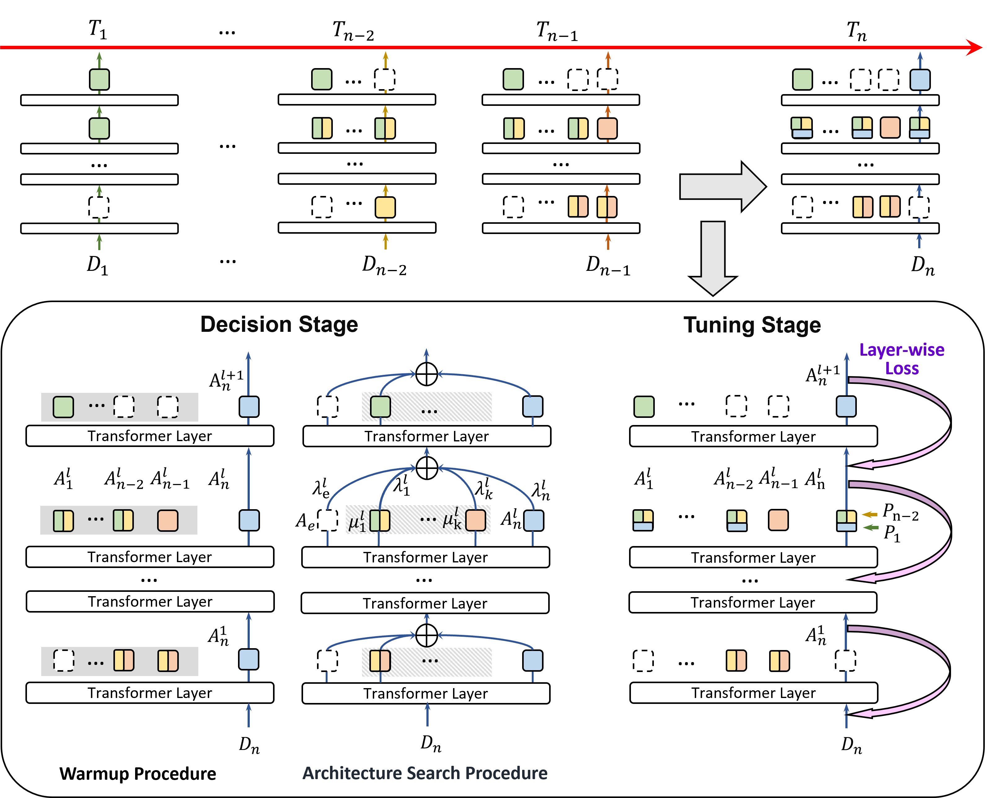

Sparse Adapter Fusion for Continual Learning in NLP
=================


This repository contains code for the paper "[Sparse Adapter Fusion for Continual Learning in NLP]()".

SAFM operates in two stages: the decision stage and the tuning stage. 
In the decision stage, SAFM determines whether to incorporate a new adapter, reuse an existing one, or add an empty adapter. The architecture search procedure, designed to prioritize reusing or adding empty adapters, minimizes parameter consumption and maximizes reuse. 
In the tuning stage, SAFM especially facilitates a layer-wise loss to encourage differentiation between adapters, effectively capturing knowledge within the same task. 





Data Preparation
-----------------
1. Define the sequential order of tasks from which your model will continuously learn. Specify the order in the file `./orders` using the following format:

    ```
    export order_1="task_1 task_2 task_3"
    ```


2. For each task (using `task_1` as an example), follow the steps below.

    i). Organize your data under `./path/to/your/data/task_1` with the following directory structure:
    ```
    ./path/to/your/data/task_1/
        --train.json
        --valid.json
        --test.json
    ```

    Register the corresponding information in `TASK_DICT`, `METRIC_DICT`, and `TASK_TYPE_DICT` within `SAFM/settings_myadaptor.py`:
    ```
    TASK_DICT = {
        "task_1": {
                "train": os.path.join('./path/to/your/data/task_1/','train.json'),
                "eval": os.path.join('./path/to/your/data/task_1/','valid.json'),
                "test": os.path.join('./path/to/your/data/task_1/','test.json'),
                "n_train_epochs": 10, 
        },
    },

    METRIC_DICT = {
        "task_1": 'rouge',
    },

    TASK_TYPE_DICT = {
         "task_1": 'nlg',
    }
    ```

    In `SAFM/data_attrs.json`, record dataset statistics:
    ```
    "e2enlg": {
        "train": {"data_size": 6000, "max_a_len": 100}, 
        "eval": {"data_size": 2000, "max_a_len": 100}, 
        "test": {"data_size": 2000, "max_a_len": 100}
        },
    ```


    ii). Each data file should follow the structure below (example shown for a natural language generation task):
    
    ```
            {"data":[
                            {
                                "title": "dummy", 
                                "paragraphs": [
                                        {
                                            "context": "attraction_inform(address=\"Cambridge Passenger Cruisers\",address=\"Jubilee House\"name=\"Riverboat Georgina\")", 
                                            "qas": [
                                                            {
                                                                "id": "MWOZ-['MWOZ_attraction']-SNG1066.json-1-SYSTEM", 
                                                                "answers": [
                                                                        {
                                                                            "answer_start": null, 
                                                                            "text": "I have one in that area. It's called the Riverboat Georgina. It's located at Cambridge Passenger Cruisers, Jubilee House. Would you like their phone number for more information?"
                                                                        }
                                                                    ], 
                                                                "question": "what is the natural language form ?", 
                                                                "is_impossible": false
                                                            }
                                                ]
                                        }
                                    ]
                            },
                            ......
                    ]
            }
    ```

    iii). Add the task-specific metric implementation to `./SAFM/metrics.py`, and register it in `./SAFM/test_myadaptor.py`. You may refer to the function below as an example:

    ```
    def get_test_score(task_eval, qa_results, score_dict):
    ...
    ```
    


Environment and Setup
-----------------
All experiments in this paper were conducted using CUDA 11.8.

1. Install dependencies:
    ```
    pip install -r requirements.txt
    ```

2. Edit the configuration file `./enviornment`.


Training and Testing
-----------------

Run the following script to start training and evaluation:
```
sh ./scripts/run.sh
```

Citation
-----------------

```bibtex
TBA
```

Thanks
-----------------

The code of this repository partly relies on [ACM](https://github.com/SALT-NLP/Adaptive-Compositional-Modules) and we would like to show our sincere gratitude to authors of it.

Concact
-----------------
If you have any questions about our paper and code, please contact the authors.

Note
-----------------
NA


